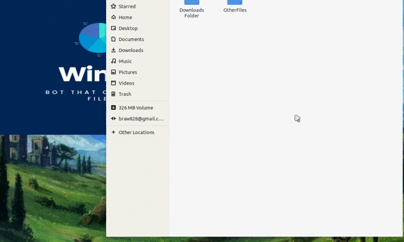

🅦🅘🅝🅓🅨

Windy is a bot powered by python3.

<ul>
<li class="has-line-data" data-line-start="8" data-line-end="9">Orginize files</li>
<li class="has-line-data" data-line-start="9" data-line-end="10">For linux and OSX</li>
<li class="has-line-data" data-line-start="10" data-line-end="11">Windows comming soon</li>
</ul>
<blockquote>

The overriding design goal for Windy is to 
make it a user friendly and customizable 
application that you can set up with ease

</blockquote>

And of course Windy itself is open source with a [public repository][Windy] 
on GitHub. 
<a href="https://github.com/braw828/Windy.git">REPO</a>

<h3 class="code-line" data-line-start=28 data-line-end=29 >Installation</h3>

Windy requires <a href="https://python.org/">Python3</a> v3+ to run.

Install the dependencies and  and start the app(<a href="http://windy.py">windy.py</a>).

<pre><code class="has-line-data" data-line-start="35" data-line-end="41" class="language-sh">$ sudo apt install git python3
$ git clone https://github.com/braw828/Windy.git
$ cd Windy
$ chmod +x windy.py
$ ./windy
</code></pre>
<h3 class="code-line" data-line-start=45 data-line-end=46 >Todos</h3>
<ul>
<li class="has-line-data" data-line-start="47" data-line-end="48">Finish bot</li>
<li class="has-line-data" data-line-start="48" data-line-end="49">Make GUI</li>
<li class="has-line-data" data-line-start="49" data-line-end="50">Make Windows port</li>
<li class="has-line-data" data-line-start="50" data-line-end="51">Clean up</li>
<li class="has-line-data" data-line-start="51" data-line-end="53">Add new features</li>
</ul>

